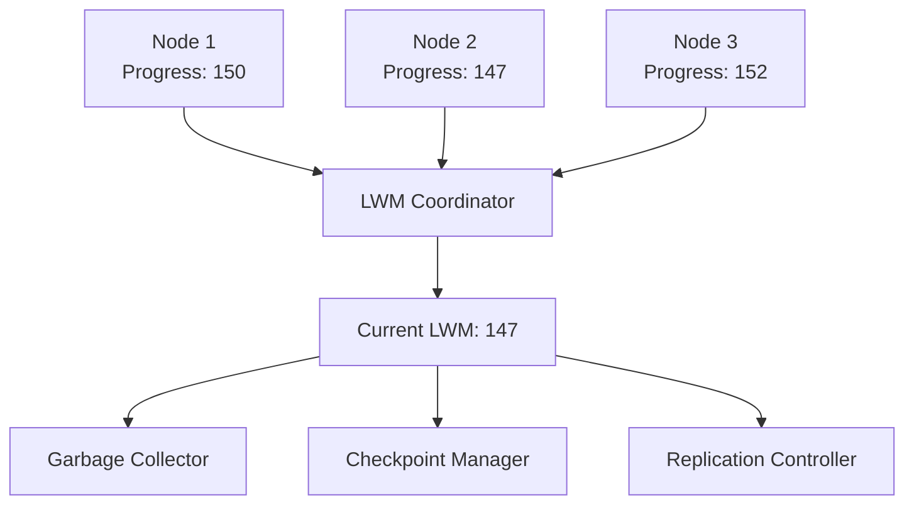
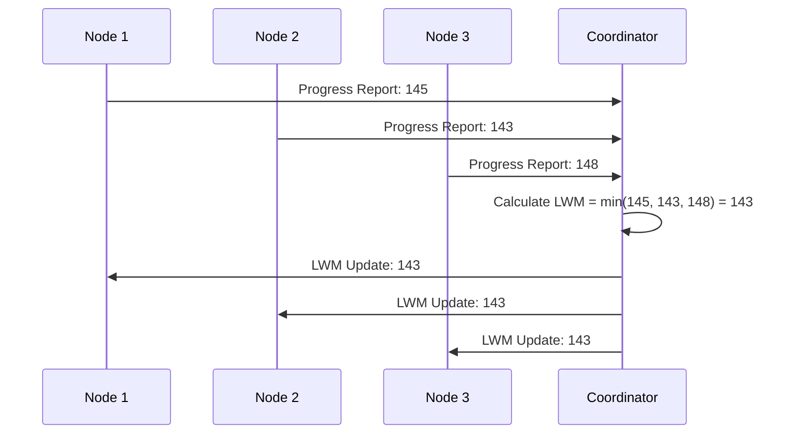
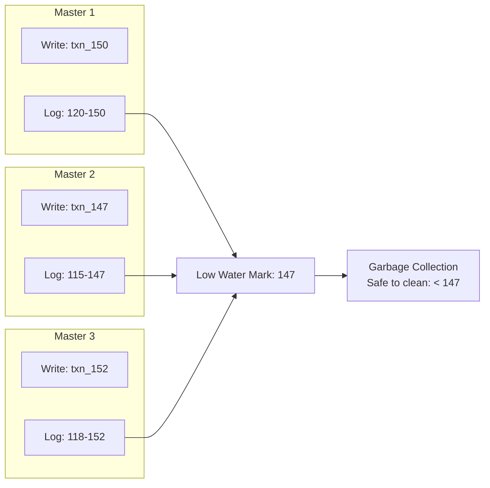
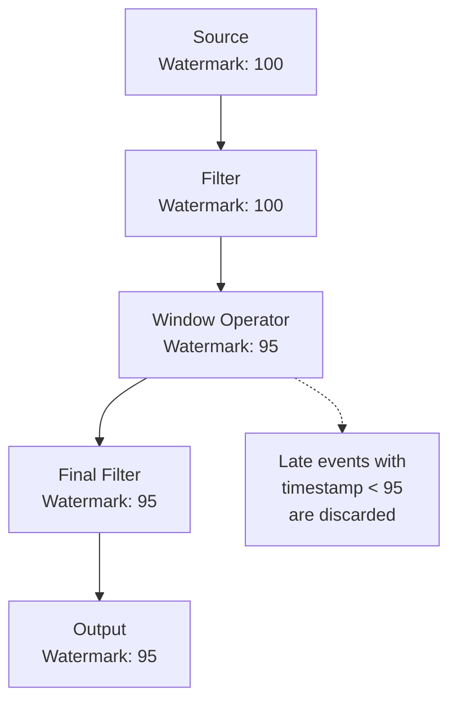
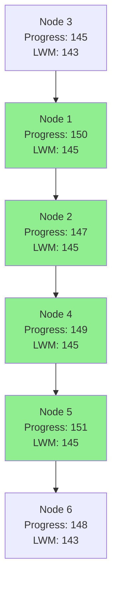
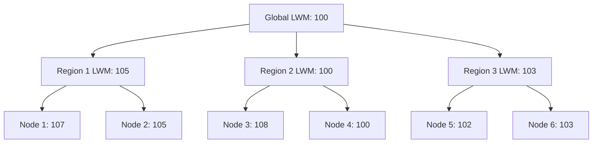
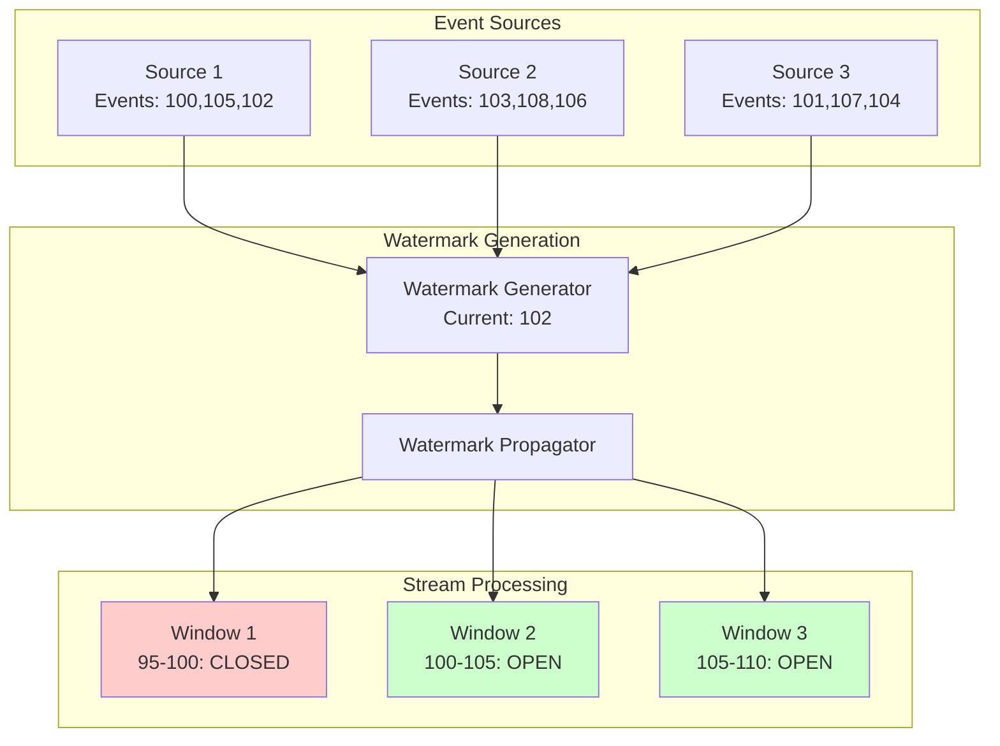

# Low Water Mark in Distributed Systems: A Comprehensive Analysis

## Abstract

The Low Water Mark (LWM) is a fundamental concept in distributed systems that plays a crucial role in maintaining consistency, managing resource allocation, and ensuring system reliability. This article provides an in-depth analysis of low water mark mechanisms, their applications in various distributed system components, and their impact on system performance and correctness. We explore the theoretical foundations, practical implementations, and trade-offs associated with low water mark algorithms in modern distributed architectures.

## 1. Introduction

In distributed systems, managing the state and progress of multiple nodes is a complex challenge that requires sophisticated coordination mechanisms. The Low Water Mark concept emerged as a critical tool for tracking the minimum progress point across a distributed system, ensuring that no node falls too far behind others and maintaining system-wide consistency guarantees.

The term "water mark" draws an analogy from hydrodynamics, where water marks indicate levels of water flow. In distributed systems, low water marks represent the minimum level of progress that all participants have achieved, serving as a safe checkpoint for various system operations.

## 2. Theoretical Foundations

### 2.1 Definition and Core Concepts

A Low Water Mark (LWM) is a monotonically increasing value that represents the minimum progress point across all participants in a distributed system. Formally, if we have a set of nodes N = \{n1, n2, ..., nk\} with progress values P = \{p1, p2, ..., pk\}, then:

```
LWM = min(P) = min(p1, p2, ..., pk)
```

The LWM serves several critical functions:

1. **Safety Guarantee**: Ensures that no operation below the LWM can be undone
2. **Garbage Collection**: Enables safe cleanup of resources below the LWM
3. **Consistency Point**: Provides a global reference for system state
4. **Flow Control**: Prevents fast nodes from getting too far ahead of slow nodes

### 2.2 Properties and Invariants

Low water marks must satisfy several important properties:

**Monotonicity**: The LWM can only increase over time, never decrease:
```
For all t1, t2 : t1 < t2 implies LWM(t1) <= LWM(t2)
```

**Consensus**: All nodes must agree on the current LWM value within a bounded time.

**Liveness**: The LWM must eventually advance if all nodes are making progress.

**Safety**: No committed operation below the LWM can be rolled back.

## 3. System Architecture and Components

### 3.1 Basic Low Water Mark System



### 3.2 Centralized vs. Decentralized Approaches

#### Centralized Low Water Mark

In a centralized approach, a designated coordinator node collects progress reports from all participants and computes the global LWM.

**Advantages:**
- Simple implementation
- Consistent global view
- Easy to reason about

**Disadvantages:**
- Single point of failure
- Scalability bottleneck
- Network overhead for frequent updates

#### Decentralized Low Water Mark

Decentralized approaches use consensus protocols or epidemic algorithms to maintain LWM without a central coordinator.

**Advantages:**
- Higher fault tolerance
- Better scalability
- Reduced network bottleneck

**Disadvantages:**
- Complex implementation
- Potential for temporary inconsistencies
- Higher computational overhead

### 3.3 Implementation Strategies



## 4. Applications in Distributed Systems

### 4.1 Database Replication

In database replication systems, low water marks ensure that:

- **Consistent Snapshots**: Queries can read from any replica at the LWM timestamp
- **Log Cleanup**: Transaction logs below the LWM can be safely purged
- **Failure Recovery**: Failed replicas can catch up from the LWM point

#### Multi-Master Replication Example



### 4.2 Stream Processing

Stream processing systems use low water marks for:

- **Event Time Processing**: Ensuring all events before a certain time have been processed
- **Window Boundaries**: Determining when time-based windows can be closed
- **Exactly-Once Semantics**: Coordinating checkpoints across parallel operators

#### Watermark Propagation in Stream Processing



### 4.3 Distributed Storage Systems

Storage systems leverage low water marks for:

- **Compaction**: Merging and cleaning up old data files
- **Snapshot Isolation**: Maintaining multiple consistent views of data
- **Backup and Recovery**: Determining safe points for backup operations

### 4.4 Message Queues and Event Streaming

In message queue systems, low water marks help with:

- **Message Acknowledgment**: Tracking the minimum acknowledged message
- **Retention Policy**: Implementing time or size-based message retention
- **Consumer Group Management**: Coordinating progress across consumer groups

## 5. Algorithms and Protocols

### 5.1 Heartbeat-Based LWM Protocol

```go
package lwm

import (
    "sync"
    "time"
)

type ProgressMessage struct {
    NodeID    string    `json:"node_id"`
    Progress  int64     `json:"progress"`
    Timestamp time.Time `json:"timestamp"`
}

type HeartbeatLWMProtocol struct {
    nodeID          string
    currentProgress int64
    coordinatorAddr string
    lwm             int64
    mutex           sync.RWMutex
}

func NewHeartbeatLWMProtocol(nodeID, coordinatorAddr string) *HeartbeatLWMProtocol {
    return &HeartbeatLWMProtocol{
        nodeID:          nodeID,
        currentProgress: 0,
        coordinatorAddr: coordinatorAddr,
        lwm:             0,
    }
}

// ReportProgress sends progress report to coordinator
func (h *HeartbeatLWMProtocol) ReportProgress() error {
    h.mutex.RLock()
    message := ProgressMessage{
        NodeID:    h.nodeID,
        Progress:  h.currentProgress,
        Timestamp: time.Now(),
    }
    h.mutex.RUnlock()
    
    return h.sendToCoordinator(message)
}

// UpdateLWM receives LWM update from coordinator
func (h *HeartbeatLWMProtocol) UpdateLWM(newLWM int64) {
    h.mutex.Lock()
    defer h.mutex.Unlock()
    
    if newLWM >= h.lwm {
        h.lwm = newLWM
        go h.triggerCleanupBelowLWM()
    }
}

func (h *HeartbeatLWMProtocol) sendToCoordinator(message ProgressMessage) error {
    // Implementation for sending message to coordinator
    return nil
}

func (h *HeartbeatLWMProtocol) triggerCleanupBelowLWM() {
    // Implementation for cleanup operations
}
```

### 5.2 Consensus-Based LWM Protocol

For decentralized systems, we can use consensus protocols like Raft or PBFT to agree on the LWM:

```go
package lwm

import (
    "sync"
)

type ConsensusLWMProtocol struct {
    nodes       []string
    progressMap map[string]int64
    lwm         int64
    mutex       sync.RWMutex
}

func NewConsensusLWMProtocol(nodes []string) *ConsensusLWMProtocol {
    return &ConsensusLWMProtocol{
        nodes:       nodes,
        progressMap: make(map[string]int64),
        lwm:         0,
    }
}

// ProposeLWMUpdate proposes new LWM based on current progress
func (c *ConsensusLWMProtocol) ProposeLWMUpdate() error {
    c.mutex.RLock()
    var currentProgresses []int64
    for _, progress := range c.progressMap {
        currentProgresses = append(currentProgresses, progress)
    }
    c.mutex.RUnlock()
    
    var proposedLWM int64 = 0
    if len(currentProgresses) > 0 {
        proposedLWM = findMin(currentProgresses)
    }
    
    // Use consensus protocol to agree on proposed LWM
    return c.consensusPropose(proposedLWM)
}

// OnConsensusDecision handles consensus decision on new LWM
func (c *ConsensusLWMProtocol) OnConsensusDecision(agreedLWM int64) {
    c.mutex.Lock()
    c.lwm = agreedLWM
    c.mutex.Unlock()
    
    go c.broadcastLWMUpdate(agreedLWM)
}

// UpdateProgress updates progress for a specific node
func (c *ConsensusLWMProtocol) UpdateProgress(nodeID string, progress int64) {
    c.mutex.Lock()
    c.progressMap[nodeID] = progress
    c.mutex.Unlock()
}

func (c *ConsensusLWMProtocol) consensusPropose(lwm int64) error {
    // Implementation for consensus protocol
    return nil
}

func (c *ConsensusLWMProtocol) broadcastLWMUpdate(lwm int64) {
    // Implementation for broadcasting LWM update
}

func findMin(values []int64) int64 {
    if len(values) == 0 {
        return 0
    }
    
    min := values[0]
    for _, v := range values[1:] {
        if v < min {
            min = v
        }
    }
    return min
}
```

### 5.3 Epidemic-Based LWM Protocol

For large-scale systems, epidemic protocols can efficiently disseminate LWM information:

```go
package lwm

import (
    "math/rand"
    "sync"
    "time"
)

type EpidemicLWMProtocol struct {
    nodeID      string
    nodes       []string
    progress    int64
    lwm         int64
    nodeStates  map[string]NodeState
    mutex       sync.RWMutex
    gossipRate  time.Duration
}

type NodeState struct {
    Progress  int64     `json:"progress"`
    LWM       int64     `json:"lwm"`
    Timestamp time.Time `json:"timestamp"`
}

type GossipMessage struct {
    SenderID   string               `json:"sender_id"`
    NodeStates map[string]NodeState `json:"node_states"`
}

func NewEpidemicLWMProtocol(nodeID string, nodes []string, gossipRate time.Duration) *EpidemicLWMProtocol {
    return &EpidemicLWMProtocol{
        nodeID:     nodeID,
        nodes:      nodes,
        progress:   0,
        lwm:        0,
        nodeStates: make(map[string]NodeState),
        gossipRate: gossipRate,
    }
}

// StartGossip begins the epidemic gossip protocol
func (e *EpidemicLWMProtocol) StartGossip() {
    ticker := time.NewTicker(e.gossipRate)
    go func() {
        for range ticker.C {
            e.gossipWithRandomNode()
        }
    }()
}

// UpdateProgress updates local progress and recalculates LWM
func (e *EpidemicLWMProtocol) UpdateProgress(newProgress int64) {
    e.mutex.Lock()
    defer e.mutex.Unlock()
    
    e.progress = newProgress
    e.nodeStates[e.nodeID] = NodeState{
        Progress:  newProgress,
        LWM:       e.lwm,
        Timestamp: time.Now(),
    }
    
    e.calculateLWM()
}

func (e *EpidemicLWMProtocol) gossipWithRandomNode() {
    if len(e.nodes) == 0 {
        return
    }
    
    // Select random node
    targetNode := e.nodes[rand.Intn(len(e.nodes))]
    if targetNode == e.nodeID {
        return
    }
    
    e.mutex.RLock()
    message := GossipMessage{
        SenderID:   e.nodeID,
        NodeStates: e.copyNodeStates(),
    }
    e.mutex.RUnlock()
    
    go e.sendGossipMessage(targetNode, message)
}

// OnGossipReceived handles incoming gossip messages
func (e *EpidemicLWMProtocol) OnGossipReceived(message GossipMessage) {
    e.mutex.Lock()
    defer e.mutex.Unlock()
    
    updated := false
    for nodeID, state := range message.NodeStates {
        if existing, exists := e.nodeStates[nodeID]; !exists || 
           state.Timestamp.After(existing.Timestamp) {
            e.nodeStates[nodeID] = state
            updated = true
        }
    }
    
    if updated {
        e.calculateLWM()
    }
}

func (e *EpidemicLWMProtocol) calculateLWM() {
    var progresses []int64
    
    for _, state := range e.nodeStates {
        progresses = append(progresses, state.Progress)
    }
    
    if len(progresses) > 0 {
        newLWM := findMin(progresses)
        if newLWM > e.lwm {
            e.lwm = newLWM
            go e.onLWMUpdate(newLWM)
        }
    }
}

func (e *EpidemicLWMProtocol) copyNodeStates() map[string]NodeState {
    copy := make(map[string]NodeState)
    for k, v := range e.nodeStates {
        copy[k] = v
    }
    return copy
}

func (e *EpidemicLWMProtocol) sendGossipMessage(targetNode string, message GossipMessage) {
    // Implementation for sending gossip message to target node
}

func (e *EpidemicLWMProtocol) onLWMUpdate(newLWM int64) {
    // Implementation for handling LWM updates
}
```



### 5.4 LWM Coordinator Implementation

Here's a complete Go implementation of an LWM coordinator that manages multiple nodes:

```go
package lwm

import (
    "context"
    "fmt"
    "sync"
    "time"
)

type LWMCoordinator struct {
    nodeProgress    map[string]int64
    currentLWM      int64
    mutex           sync.RWMutex
    updateInterval  time.Duration
    nodeTimeout     time.Duration
    lastHeartbeat   map[string]time.Time
    subscribers     []chan int64
    ctx             context.Context
    cancel          context.CancelFunc
}

type NodeProgressUpdate struct {
    NodeID    string `json:"node_id"`
    Progress  int64  `json:"progress"`
    Timestamp time.Time `json:"timestamp"`
}

func NewLWMCoordinator(updateInterval, nodeTimeout time.Duration) *LWMCoordinator {
    ctx, cancel := context.WithCancel(context.Background())
    return &LWMCoordinator{
        nodeProgress:   make(map[string]int64),
        currentLWM:     0,
        updateInterval: updateInterval,
        nodeTimeout:    nodeTimeout,
        lastHeartbeat:  make(map[string]time.Time),
        subscribers:    make([]chan int64, 0),
        ctx:            ctx,
        cancel:         cancel,
    }
}

// Start begins the coordinator's main processing loop
func (c *LWMCoordinator) Start() {
    go c.updateLoop()
    go c.healthCheckLoop()
}

// Stop gracefully shuts down the coordinator
func (c *LWMCoordinator) Stop() {
    c.cancel()
}

// RegisterNode adds a new node to tracking
func (c *LWMCoordinator) RegisterNode(nodeID string, initialProgress int64) {
    c.mutex.Lock()
    defer c.mutex.Unlock()
    
    c.nodeProgress[nodeID] = initialProgress
    c.lastHeartbeat[nodeID] = time.Now()
}

// UpdateNodeProgress receives progress updates from nodes
func (c *LWMCoordinator) UpdateNodeProgress(update NodeProgressUpdate) error {
    c.mutex.Lock()
    defer c.mutex.Unlock()
    
    // Validate progress is monotonic
    if existing, exists := c.nodeProgress[update.NodeID]; exists && update.Progress < existing {
        return fmt.Errorf("progress update %d is less than current %d for node %s", 
            update.Progress, existing, update.NodeID)
    }
    
    c.nodeProgress[update.NodeID] = update.Progress
    c.lastHeartbeat[update.NodeID] = update.Timestamp
    
    return nil
}

// Subscribe allows components to receive LWM updates
func (c *LWMCoordinator) Subscribe() <-chan int64 {
    c.mutex.Lock()
    defer c.mutex.Unlock()
    
    ch := make(chan int64, 10)
    c.subscribers = append(c.subscribers, ch)
    return ch
}

// GetCurrentLWM returns the current low water mark
func (c *LWMCoordinator) GetCurrentLWM() int64 {
    c.mutex.RLock()
    defer c.mutex.RUnlock()
    return c.currentLWM
}

// GetNodeProgress returns progress information for all nodes
func (c *LWMCoordinator) GetNodeProgress() map[string]int64 {
    c.mutex.RLock()
    defer c.mutex.RUnlock()
    
    result := make(map[string]int64)
    for nodeID, progress := range c.nodeProgress {
        result[nodeID] = progress
    }
    return result
}

func (c *LWMCoordinator) updateLoop() {
    ticker := time.NewTicker(c.updateInterval)
    defer ticker.Stop()
    
    for {
        select {
        case <-c.ctx.Done():
            return
        case <-ticker.C:
            c.calculateAndUpdateLWM()
        }
    }
}

func (c *LWMCoordinator) healthCheckLoop() {
    ticker := time.NewTicker(c.nodeTimeout / 2)
    defer ticker.Stop()
    
    for {
        select {
        case <-c.ctx.Done():
            return
        case <-ticker.C:
            c.removeStaleNodes()
        }
    }
}

func (c *LWMCoordinator) calculateAndUpdateLWM() {
    c.mutex.Lock()
    defer c.mutex.Unlock()
    
    if len(c.nodeProgress) == 0 {
        return
    }
    
    var progresses []int64
    for _, progress := range c.nodeProgress {
        progresses = append(progresses, progress)
    }
    
    newLWM := findMin(progresses)
    if newLWM > c.currentLWM {
        c.currentLWM = newLWM
        c.notifySubscribers(newLWM)
    }
}

func (c *LWMCoordinator) removeStaleNodes() {
    c.mutex.Lock()
    defer c.mutex.Unlock()
    
    now := time.Now()
    for nodeID, lastSeen := range c.lastHeartbeat {
        if now.Sub(lastSeen) > c.nodeTimeout {
            delete(c.nodeProgress, nodeID)
            delete(c.lastHeartbeat, nodeID)
            fmt.Printf("Removed stale node: %s\n", nodeID)
        }
    }
}

func (c *LWMCoordinator) notifySubscribers(newLWM int64) {
    for _, ch := range c.subscribers {
        select {
        case ch <- newLWM:
        default:
            // Channel is full, skip this notification
        }
    }
}

// Example usage and testing
func ExampleUsage() {
    coordinator := NewLWMCoordinator(5*time.Second, 30*time.Second)
    coordinator.Start()
    defer coordinator.Stop()
    
    // Subscribe to LWM updates
    lwmUpdates := coordinator.Subscribe()
    
    // Register nodes
    coordinator.RegisterNode("node-1", 100)
    coordinator.RegisterNode("node-2", 95)
    coordinator.RegisterNode("node-3", 102)
    
    // Simulate progress updates
    go func() {
        for i := 0; i < 10; i++ {
            time.Sleep(2 * time.Second)
            coordinator.UpdateNodeProgress(NodeProgressUpdate{
                NodeID:    "node-1",
                Progress:  100 + int64(i),
                Timestamp: time.Now(),
            })
        }
    }()
    
    // Listen for LWM updates
    go func() {
        for lwm := range lwmUpdates {
            fmt.Printf("New LWM: %d\n", lwm)
        }
    }()
    
    time.Sleep(30 * time.Second)
}
```

### 6.1 Latency Considerations

The frequency of LWM updates creates a trade-off between:

- **Accuracy**: More frequent updates provide more accurate LWM values
- **Overhead**: Frequent updates increase network and computational overhead
- **Lag**: Less frequent updates may cause the LWM to lag behind actual progress

### 6.2 Scalability Analysis

The scalability of LWM systems depends on several factors:

**Network Complexity:**
- Centralized: O(n) messages per update round
- Decentralized: O(n log n) for consensus-based approaches
- Epidemic: O(log n) convergence time with O(n) total messages

**Memory Overhead:**
- Each node must track progress of all participants
- Storage complexity: O(n) per node

### 6.3 Fault Tolerance

LWM systems must handle various failure scenarios:

**Node Failures:**
- Temporary failures should not permanently block LWM advancement
- Use timeouts and failure detection mechanisms
- Implement node replacement strategies

**Network Partitions:**
- Partition-tolerant LWM algorithms must choose between availability and consistency
- Consider using quorum-based approaches

**Byzantine Failures:**
- For systems requiring Byzantine fault tolerance
- Use authenticated messages and majority agreement

## 7. Advanced Topics

### 7.1 Multi-Level Low Water Marks

Some systems employ hierarchical LWM structures:



### 7.2 Adaptive Low Water Mark Algorithms

Advanced systems may adapt their LWM update frequency based on:

- System load and performance metrics
- Network conditions and latency
- Application-specific requirements
- Historical progress patterns

### 7.4 Snapshot-Based Low Water Marks

Snapshot-based Low Water Marks represent one of the most sophisticated applications of LWM concepts in distributed systems, particularly in systems implementing Multi-Version Concurrency Control (MVCC) and temporal data management. This approach combines the principles of distributed snapshots with low water mark semantics to provide consistent, point-in-time views of data across distributed nodes.

#### Theoretical Foundation

In snapshot-based systems, each transaction or read operation operates on a specific snapshot of the database state, identified by a logical timestamp or version number. The snapshot LWM represents the earliest timestamp for which the system must retain all versions of data, ensuring that active snapshots remain consistent and readable.

Formally, given a set of active snapshots S = \{s1, s2, ..., sn\} with timestamps T = \{t1, t2, ..., tn\}, the Snapshot Low Water Mark (SLWM) is defined as:

```
SLWM = min(T) = min(t1, t2, ..., tn)
```

This SLWM serves as a garbage collection boundary, below which no data versions need to be retained.

#### Architecture and Implementation

```mermaid
graph TB
    subgraph "Snapshot Management Layer"
        SM[Snapshot Manager]
        ST[Snapshot Tracker]
        GC[Garbage Collector]
    end
    
    subgraph "Storage Layer"
        V1[Version 100]
        V2[Version 150]
        V3[Version 200]
        V4[Version 250]
    end
    
    subgraph "Active Snapshots"
        S1[Snapshot@150]
        S2[Snapshot@180] 
        S3[Snapshot@220]
    end
    
    SM --> ST
    ST --> GC
    S1 --> ST
    S2 --> ST
    S3 --> ST
    ST --> |SLWM=150| GC
    GC --> |Can GC < 150| V1
    GC --> |Keep >= 150| V2
    GC --> |Keep >= 150| V3
    GC --> |Keep >= 150| V4
```

#### Complete Go Implementation

```go
package snapshot

import (
    "context"
    "fmt"
    "sync"
    "time"
)

// SnapshotLWM manages snapshot-based low water marks for MVCC systems
type SnapshotLWM struct {
    // activeSnapshots maps snapshot IDs to their timestamps
    activeSnapshots map[string]int64
    
    // snapshotMetadata stores additional information about snapshots
    snapshotMetadata map[string]*SnapshotInfo
    
    // currentLWM holds the current low water mark
    currentLWM int64
    
    // maxRetentionPeriod defines maximum time to retain snapshots
    maxRetentionPeriod time.Duration
    
    // mutex protects concurrent access to snapshot data
    mutex sync.RWMutex
    
    // subscribers receive notifications when LWM changes
    subscribers []chan LWMUpdate
    
    // metrics for monitoring
    metrics *SnapshotMetrics
    
    // context for graceful shutdown
    ctx    context.Context
    cancel context.CancelFunc
}

// SnapshotInfo contains metadata about a snapshot
type SnapshotInfo struct {
    SnapshotID    string    `json:"snapshot_id"`
    Timestamp     int64     `json:"timestamp"`
    CreatedAt     time.Time `json:"created_at"`
    AccessCount   int64     `json:"access_count"`
    LastAccessed  time.Time `json:"last_accessed"`
    IsReadOnly    bool      `json:"is_read_only"`
    IsolationLevel string   `json:"isolation_level"`
    OwnerNodeID   string    `json:"owner_node_id"`
}

// LWMUpdate represents a low water mark update notification
type LWMUpdate struct {
    OldLWM      int64     `json:"old_lwm"`
    NewLWM      int64     `json:"new_lwm"`
    Timestamp   time.Time `json:"timestamp"`
    GCCandidate bool      `json:"gc_candidate"`
}

// SnapshotMetrics tracks performance metrics for snapshot management
type SnapshotMetrics struct {
    ActiveSnapshots      int64 `json:"active_snapshots"`
    TotalSnapshotsCreated int64 `json:"total_snapshots_created"`
    SnapshotsGarbageCollected int64 `json:"snapshots_garbage_collected"`
    AverageSnapshotLifetime time.Duration `json:"average_snapshot_lifetime"`
    LWMUpdates          int64 `json:"lwm_updates"`
    GCOperations        int64 `json:"gc_operations"`
}

// NewSnapshotLWM creates a new snapshot-based LWM manager
func NewSnapshotLWM(maxRetentionPeriod time.Duration) *SnapshotLWM {
    ctx, cancel := context.WithCancel(context.Background())
    
    return &SnapshotLWM{
        activeSnapshots:     make(map[string]*SnapshotInfo),
        snapshotMetadata:   make(map[string]*SnapshotInfo),
        currentLWM:         0,
        maxRetentionPeriod: maxRetentionPeriod,
        subscribers:        make([]chan LWMUpdate, 0),
        metrics:           &SnapshotMetrics{},
        ctx:               ctx,
        cancel:            cancel,
    }
}

// Start begins the snapshot LWM management process
func (s *SnapshotLWM) Start() {
    go s.maintenanceLoop()
    go s.metricsUpdateLoop()
}

// Stop gracefully shuts down the snapshot LWM manager
func (s *SnapshotLWM) Stop() {
    s.cancel()
}

// CreateSnapshot creates a new snapshot with the given timestamp
func (s *SnapshotLWM) CreateSnapshot(snapshotID string, timestamp int64, nodeID string, isolationLevel string) (*SnapshotInfo, error) {
    s.mutex.Lock()
    defer s.mutex.Unlock()
    
    if _, exists := s.activeSnapshots[snapshotID]; exists {
        return nil, fmt.Errorf("snapshot %s already exists", snapshotID)
    }
    
    // Validate timestamp is not too old
    if timestamp < s.currentLWM {
        return nil, fmt.Errorf("snapshot timestamp %d is below current LWM %d", timestamp, s.currentLWM)
    }
    
    info := &SnapshotInfo{
        SnapshotID:     snapshotID,
        Timestamp:      timestamp,
        CreatedAt:      time.Now(),
        AccessCount:    0,
        LastAccessed:   time.Now(),
        IsReadOnly:     true,
        IsolationLevel: isolationLevel,
        OwnerNodeID:    nodeID,
    }
    
    s.activeSnapshots[snapshotID] = info
    s.snapshotMetadata[snapshotID] = info
    s.metrics.TotalSnapshotsCreated++
    s.metrics.ActiveSnapshots++
    
    // Recalculate LWM after adding new snapshot
    s.recalculateLWM()
    
    return info, nil
}

// AccessSnapshot records access to a snapshot for tracking purposes
func (s *SnapshotLWM) AccessSnapshot(snapshotID string) error {
    s.mutex.Lock()
    defer s.mutex.Unlock()
    
    info, exists := s.activeSnapshots[snapshotID]
    if !exists {
        return fmt.Errorf("snapshot %s not found", snapshotID)
    }
    
    info.AccessCount++
    info.LastAccessed = time.Now()
    
    return nil
}

// ReleaseSnapshot releases a snapshot, making it eligible for garbage collection
func (s *SnapshotLWM) ReleaseSnapshot(snapshotID string) error {
    s.mutex.Lock()
    defer s.mutex.Unlock()
    
    info, exists := s.activeSnapshots[snapshotID]
    if !exists {
        return fmt.Errorf("snapshot %s not found", snapshotID)
    }
    
    delete(s.activeSnapshots, snapshotID)
    s.metrics.ActiveSnapshots--
    
    // Update average lifetime metric
    lifetime := time.Since(info.CreatedAt)
    s.updateAverageLifetime(lifetime)
    
    // Recalculate LWM after removing snapshot
    oldLWM := s.currentLWM
    s.recalculateLWM()
    
    // Notify subscribers if LWM changed
    if s.currentLWM != oldLWM {
        s.notifyLWMUpdate(oldLWM, s.currentLWM, true)
    }
    
    return nil
}

// GetCurrentLWM returns the current low water mark
func (s *SnapshotLWM) GetCurrentLWM() int64 {
    s.mutex.RLock()
    defer s.mutex.RUnlock()
    return s.currentLWM
}

// GetActiveSnapshots returns information about all active snapshots
func (s *SnapshotLWM) GetActiveSnapshots() map[string]*SnapshotInfo {
    s.mutex.RLock()
    defer s.mutex.RUnlock()
    
    result := make(map[string]*SnapshotInfo)
    for id, info := range s.activeSnapshots {
        // Create a copy to avoid race conditions
        infoCopy := *info
        result[id] = &infoCopy
    }
    
    return result
}

// GetMetrics returns current performance metrics
func (s *SnapshotLWM) GetMetrics() *SnapshotMetrics {
    s.mutex.RLock()
    defer s.mutex.RUnlock()
    
    // Return a copy of metrics
    metricsCopy := *s.metrics
    metricsCopy.ActiveSnapshots = int64(len(s.activeSnapshots))
    
    return &metricsCopy
}

// Subscribe allows components to receive LWM update notifications
func (s *SnapshotLWM) Subscribe() <-chan LWMUpdate {
    s.mutex.Lock()
    defer s.mutex.Unlock()
    
    ch := make(chan LWMUpdate, 10)
    s.subscribers = append(s.subscribers, ch)
    return ch
}

// recalculateLWM recalculates the current low water mark
func (s *SnapshotLWM) recalculateLWM() {
    if len(s.activeSnapshots) == 0 {
        return
    }
    
    var minTimestamp int64 = -1
    for _, info := range s.activeSnapshots {
        if minTimestamp == -1 || info.Timestamp < minTimestamp {
            minTimestamp = info.Timestamp
        }
    }
    
    oldLWM := s.currentLWM
    if minTimestamp > s.currentLWM {
        s.currentLWM = minTimestamp
        s.metrics.LWMUpdates++
        s.notifyLWMUpdate(oldLWM, s.currentLWM, false)
    }
}

// maintenanceLoop performs periodic maintenance tasks
func (s *SnapshotLWM) maintenanceLoop() {
    ticker := time.NewTicker(s.maxRetentionPeriod / 10)
    defer ticker.Stop()
    
    for {
        select {
        case <-s.ctx.Done():
            return
        case <-ticker.C:
            s.performMaintenance()
        }
    }
}

// performMaintenance cleans up expired snapshots
func (s *SnapshotLWM) performMaintenance() {
    s.mutex.Lock()
    defer s.mutex.Unlock()
    
    now := time.Now()
    var expiredSnapshots []string
    
    for id, info := range s.activeSnapshots {
        if now.Sub(info.CreatedAt) > s.maxRetentionPeriod {
            expiredSnapshots = append(expiredSnapshots, id)
        }
    }
    
    // Remove expired snapshots
    for _, id := range expiredSnapshots {
        delete(s.activeSnapshots, id)
        s.metrics.ActiveSnapshots--
        s.metrics.SnapshotsGarbageCollected++
    }
    
    if len(expiredSnapshots) > 0 {
        s.metrics.GCOperations++
        oldLWM := s.currentLWM
        s.recalculateLWM()
        
        if s.currentLWM != oldLWM {
            s.notifyLWMUpdate(oldLWM, s.currentLWM, true)
        }
    }
}

// metricsUpdateLoop periodically updates performance metrics
func (s *SnapshotLWM) metricsUpdateLoop() {
    ticker := time.NewTicker(30 * time.Second)
    defer ticker.Stop()
    
    for {
        select {
        case <-s.ctx.Done():
            return
        case <-ticker.C:
            s.updateMetrics()
        }
    }
}

// updateMetrics updates internal performance metrics
func (s *SnapshotLWM) updateMetrics() {
    s.mutex.Lock()
    defer s.mutex.Unlock()
    
    s.metrics.ActiveSnapshots = int64(len(s.activeSnapshots))
}

// updateAverageLifetime updates the average snapshot lifetime metric
func (s *SnapshotLWM) updateAverageLifetime(newLifetime time.Duration) {
    // Simple moving average calculation
    if s.metrics.AverageSnapshotLifetime == 0 {
        s.metrics.AverageSnapshotLifetime = newLifetime
    } else {
        s.metrics.AverageSnapshotLifetime = (s.metrics.AverageSnapshotLifetime + newLifetime) / 2
    }
}

// notifyLWMUpdate sends LWM update notifications to subscribers
func (s *SnapshotLWM) notifyLWMUpdate(oldLWM, newLWM int64, gcCandidate bool) {
    update := LWMUpdate{
        OldLWM:      oldLWM,
        NewLWM:      newLWM,
        Timestamp:   time.Now(),
        GCCandidate: gcCandidate,
    }
    
    for _, ch := range s.subscribers {
        select {
        case ch <- update:
        default:
            // Channel is full, skip this notification
        }
    }
}

// SnapshotReader provides read operations for snapshot-based queries
type SnapshotReader struct {
    snapshotLWM *SnapshotLWM
    snapshotID  string
}

// NewSnapshotReader creates a new snapshot reader for the given snapshot
func (s *SnapshotLWM) NewSnapshotReader(snapshotID string) (*SnapshotReader, error) {
    if err := s.AccessSnapshot(snapshotID); err != nil {
        return nil, err
    }
    
    return &SnapshotReader{
        snapshotLWM: s,
        snapshotID:  snapshotID,
    }, nil
}

// ReadAtTimestamp performs a read operation at the snapshot's timestamp
func (sr *SnapshotReader) ReadAtTimestamp(key string) (interface{}, error) {
    // Record access for metrics
    sr.snapshotLWM.AccessSnapshot(sr.snapshotID)
    
    // Implementation would interface with underlying storage
    // This is a placeholder for the actual read logic
    return nil, fmt.Errorf("read implementation required")
}
```

#### Integration with Distributed Consensus

Snapshot-based LWM systems often require coordination across multiple nodes to ensure global consistency. Here's an example of how to integrate with a consensus protocol:

```go
package snapshot

import (
    "encoding/json"
    "time"
)

// DistributedSnapshotLWM coordinates snapshot LWMs across multiple nodes
type DistributedSnapshotLWM struct {
    localLWM     *SnapshotLWM
    nodeID       string
    peers        []string
    consensusLWM int64
    mutex        sync.RWMutex
}

// LWMProposal represents a proposal for updating the global LWM
type LWMProposal struct {
    NodeID       string `json:"node_id"`
    ProposedLWM  int64  `json:"proposed_lwm"`
    Timestamp    int64  `json:"timestamp"`
    SnapshotCount int   `json:"snapshot_count"`
}

// GlobalLWMState represents the agreed-upon global LWM state
type GlobalLWMState struct {
    GlobalLWM     int64            `json:"global_lwm"`
    NodeLWMs      map[string]int64 `json:"node_lwms"`
    LastUpdated   time.Time        `json:"last_updated"`
    ConsensusRound int64           `json:"consensus_round"`
}

// NewDistributedSnapshotLWM creates a new distributed snapshot LWM coordinator
func NewDistributedSnapshotLWM(nodeID string, peers []string, maxRetentionPeriod time.Duration) *DistributedSnapshotLWM {
    return &DistributedSnapshotLWM{
        localLWM:     NewSnapshotLWM(maxRetentionPeriod),
        nodeID:       nodeID,
        peers:        peers,
        consensusLWM: 0,
    }
}

// ProposeGlobalLWMUpdate proposes a new global LWM based on local state
func (d *DistributedSnapshotLWM) ProposeGlobalLWMUpdate() error {
    localLWM := d.localLWM.GetCurrentLWM()
    activeSnapshots := d.localLWM.GetActiveSnapshots()
    
    proposal := LWMProposal{
        NodeID:        d.nodeID,
        ProposedLWM:   localLWM,
        Timestamp:     time.Now().UnixNano(),
        SnapshotCount: len(activeSnapshots),
    }
    
    return d.broadcastProposal(proposal)
}

// OnProposalReceived handles incoming LWM proposals from other nodes
func (d *DistributedSnapshotLWM) OnProposalReceived(proposal LWMProposal) error {
    // Validate proposal
    if proposal.ProposedLWM < 0 {
        return fmt.Errorf("invalid negative LWM proposal from node %s", proposal.NodeID)
    }
    
    // Process proposal through consensus algorithm
    return d.processProposalThroughConsensus(proposal)
}

// ApplyGlobalLWMDecision applies a consensus decision about the global LWM
func (d *DistributedSnapshotLWM) ApplyGlobalLWMDecision(state GlobalLWMState) error {
    d.mutex.Lock()
    defer d.mutex.Unlock()
    
    if state.GlobalLWM > d.consensusLWM {
        d.consensusLWM = state.GlobalLWM
        // Trigger local cleanup based on global LWM
        return d.enforceGlobalLWM(state.GlobalLWM)
    }
    
    return nil
}

func (d *DistributedSnapshotLWM) broadcastProposal(proposal LWMProposal) error {
    // Implementation for broadcasting proposal to peer nodes
    return nil
}

func (d *DistributedSnapshotLWM) processProposalThroughConsensus(proposal LWMProposal) error {
    // Implementation for processing proposal through consensus protocol
    return nil
}

func (d *DistributedSnapshotLWM) enforceGlobalLWM(globalLWM int64) error {
    // Implementation for enforcing global LWM constraints locally
    return nil
}
```

#### Performance Characteristics and Analysis

Snapshot-based LWM systems exhibit unique performance characteristics that distinguish them from simpler LWM implementations:

**Time Complexity:**
- Snapshot creation: O(log n) where n is the number of active snapshots
- LWM calculation: O(n) where n is the number of active snapshots
- Garbage collection: O(m) where m is the number of expired snapshots

**Space Complexity:**
- Memory overhead: O(n * k) where n is active snapshots and k is metadata size
- Storage overhead for versioned data: O(v * s) where v is versions and s is data size

**Network Complexity (Distributed):**
- Consensus rounds: O(p²) messages where p is the number of participating nodes
- Convergence time: O(log p) rounds for typical consensus protocols

#### Applications in Real-World Systems

**Google Spanner:** Uses snapshot-based LWM for TrueTime-based consistency, ensuring that reads at a specific timestamp see a consistent view across all replicas globally.

**CockroachDB:** Implements snapshot isolation using LWM for MVCC garbage collection, allowing the system to safely remove old versions while maintaining read consistency.

**FoundationDB:** Employs snapshot-based LWM for its versioned key-value store, enabling point-in-time recovery and consistent distributed transactions.

#### Best Practices and Considerations

1. **Snapshot Timeout Management:** Implement aggressive timeout policies to prevent resource leaks
2. **Batch Operations:** Group snapshot operations to reduce coordination overhead
3. **Monitoring:** Track metrics like snapshot lifetime and LWM advancement rate
4. **Graceful Degradation:** Handle node failures without blocking LWM advancement
5. **Memory Management:** Implement efficient metadata storage for large numbers of snapshots

This snapshot-based approach to Low Water Mark management provides the foundation for building sophisticated distributed systems with strong consistency guarantees while maintaining high performance and scalability.

Low water marks often work in conjunction with:

- **Vector Clocks**: For causality tracking
- **Merkle Trees**: For efficient state synchronization
- **Bloom Filters**: For efficient membership testing
- **Consistent Hashing**: For load distribution

## 8. Case Studies

### 8.1 Apache Kafka

Kafka uses low water marks for:
- **Log Compaction**: Determining which segments can be compacted
- **Consumer Lag Monitoring**: Tracking consumer group progress
- **Replica Synchronization**: Ensuring all replicas have caught up

### 8.2 Google Spanner

Spanner employs low water marks in:
- **TrueTime API**: Managing timestamp ordering across datacenters
- **Multi-Version Concurrency Control**: Garbage collecting old versions
- **Global Transaction Coordination**: Ensuring serializable transactions

### 8.3 Apache Flink

Flink uses watermarks for:
- **Event Time Processing**: Handling out-of-order events
- **Window Operations**: Triggering window computations
- **Checkpointing**: Coordinating distributed checkpoints

## 9. Implementation Best Practices

### 9.1 Design Principles

1. **Keep It Simple**: Start with simple centralized approaches before moving to complex distributed solutions
2. **Monitor Progress**: Implement comprehensive monitoring and alerting for LWM lag
3. **Handle Failures Gracefully**: Design for failure scenarios from the beginning
4. **Optimize for the Common Case**: Optimize for normal operation, handle edge cases separately

### 9.2 Configuration Guidelines

```yaml
# Example LWM Configuration
low_water_mark:
  update_frequency: 5s          # How often to update LWM
  timeout: 30s                  # Timeout for node progress reports
  max_lag: 1000                # Maximum allowed lag behind LWM
  gc_interval: 300s             # Garbage collection interval
  
  # Failure handling
  failure_detection:
    heartbeat_interval: 10s
    failure_timeout: 60s
    max_failures: 3
    
  # Performance tuning
  batch_size: 100              # Batch size for progress reports
  compression: true            # Compress progress messages
  async_updates: true          # Use asynchronous updates
```

Corresponding Go configuration struct:

```go
package lwm

import "time"

type LWMConfig struct {
    UpdateFrequency time.Duration `yaml:"update_frequency" json:"update_frequency"`
    Timeout         time.Duration `yaml:"timeout" json:"timeout"`
    MaxLag          int64         `yaml:"max_lag" json:"max_lag"`
    GCInterval      time.Duration `yaml:"gc_interval" json:"gc_interval"`
    
    FailureDetection struct {
        HeartbeatInterval time.Duration `yaml:"heartbeat_interval" json:"heartbeat_interval"`
        FailureTimeout    time.Duration `yaml:"failure_timeout" json:"failure_timeout"`
        MaxFailures       int           `yaml:"max_failures" json:"max_failures"`
    } `yaml:"failure_detection" json:"failure_detection"`
    
    Performance struct {
        BatchSize     int  `yaml:"batch_size" json:"batch_size"`
        Compression   bool `yaml:"compression" json:"compression"`
        AsyncUpdates  bool `yaml:"async_updates" json:"async_updates"`
    } `yaml:"performance" json:"performance"`
}

// DefaultConfig returns a configuration with sensible defaults
func DefaultConfig() *LWMConfig {
    config := &LWMConfig{
        UpdateFrequency: 5 * time.Second,
        Timeout:         30 * time.Second,
        MaxLag:          1000,
        GCInterval:      300 * time.Second,
    }
    
    config.FailureDetection.HeartbeatInterval = 10 * time.Second
    config.FailureDetection.FailureTimeout = 60 * time.Second
    config.FailureDetection.MaxFailures = 3
    
    config.Performance.BatchSize = 100
    config.Performance.Compression = true
    config.Performance.AsyncUpdates = true
    
    return config
}

// ValidateConfig checks if the configuration is valid
func (c *LWMConfig) ValidateConfig() error {
    if c.UpdateFrequency <= 0 {
        return fmt.Errorf("update_frequency must be positive")
    }
    if c.Timeout <= 0 {
        return fmt.Errorf("timeout must be positive")
    }
    if c.MaxLag < 0 {
        return fmt.Errorf("max_lag cannot be negative")
    }
    return nil
}
```

### 9.3 Testing Strategies

Testing LWM systems requires:

1. **Unit Tests**: Test individual component behavior
2. **Integration Tests**: Test interaction between components
3. **Chaos Engineering**: Test behavior under failure conditions
4. **Performance Tests**: Measure overhead and scalability
5. **Correctness Tests**: Verify safety and liveness properties

## 10. Future Directions and Research

### 10.1 Machine Learning Integration

Future LWM systems may leverage ML for:
- **Predictive LWM Updates**: Predicting future progress patterns
- **Adaptive Algorithms**: Learning optimal update frequencies
- **Anomaly Detection**: Identifying unusual progress patterns

### 10.2 Quantum-Safe Low Water Marks

As quantum computing advances, LWM systems may need:
- **Quantum-Resistant Cryptography**: For secure message authentication
- **Post-Quantum Consensus**: For Byzantine fault tolerance

### 10.3 Edge Computing Applications

Low water marks in edge computing environments face unique challenges:
- **Network Intermittency**: Handling disconnected operation
- **Heterogeneous Devices**: Managing varying computational capabilities
- **Mobility**: Handling node mobility and topology changes

## 11. Conclusion

Low Water Mark mechanisms are fundamental building blocks of modern distributed systems, providing essential guarantees for consistency, garbage collection, and coordination. As distributed systems continue to grow in scale and complexity, the importance of efficient and robust LWM algorithms will only increase.

The choice of LWM implementation depends on specific system requirements, including scalability needs, fault tolerance requirements, and consistency guarantees. While centralized approaches offer simplicity, decentralized solutions provide better fault tolerance and scalability for large-scale systems.

Future research in this area will likely focus on adaptive algorithms, integration with emerging technologies, and optimization for new deployment paradigms such as edge computing and serverless architectures.

Understanding and properly implementing Low Water Mark mechanisms is crucial for building reliable, scalable, and efficient distributed systems that can meet the demands of modern applications and use cases.

### 7.6 Time-Based Low Water Marks

Time-based Low Water Marks represent one of the most practical and widely deployed LWM variants in modern distributed systems, particularly in stream processing, event-driven architectures, and temporal database systems. Unlike position-based or snapshot-based approaches, time-based LWMs use temporal semantics to define progress and consistency boundaries.

#### Theoretical Foundation and Temporal Semantics

In time-based systems, events are associated with timestamps that can represent either:

- **Event Time**: When the event actually occurred in the real world
- **Processing Time**: When the event is processed by the system
- **Ingestion Time**: When the event enters the system

The Time-based Low Water Mark (TLWM) represents the earliest event time for which the system guarantees that no more events will arrive. Formally, given a stream of events E with timestamps T = \{t1, t2, ..., tn\}, the TLWM at processing time P is:

```
TLWM(P) = max{t | ∀ future events e: timestamp(e) >= t}
```

This definition ensures that once TLWM advances past time t, no events with timestamps ≤ t will be processed.

#### Architecture and Event Flow



#### Comprehensive Go Implementation

```go
package timebased

import (
    "context"
    "fmt"
    "math"
    "sort"
    "sync"
    "time"
)

// EventTime represents a logical timestamp for events
type EventTime int64

// Watermark represents a time-based low water mark
type Watermark struct {
    Timestamp EventTime `json:"timestamp"`
    CreatedAt time.Time `json:"created_at"`
    SourceID  string    `json:"source_id"`
}

// Event represents a timestamped event in the stream
type Event struct {
    ID        string      `json:"id"`
    Timestamp EventTime   `json:"timestamp"`
    Data      interface{} `json:"data"`
    SourceID  string      `json:"source_id"`
    ArrivalTime time.Time `json:"arrival_time"`
}

// WatermarkStrategy defines how watermarks are generated
type WatermarkStrategy interface {
    GenerateWatermark(events []Event) Watermark
    GetMaxOutOfOrderness() time.Duration
    IsEventLate(event Event, currentWatermark Watermark) bool
}

// TimeBoundedWatermarkStrategy generates watermarks based on time bounds
type TimeBoundedWatermarkStrategy struct {
    maxOutOfOrderness time.Duration
    idleTimeout       time.Duration
}

func NewTimeBoundedStrategy(maxOutOfOrderness, idleTimeout time.Duration) *TimeBoundedWatermarkStrategy {
    return &TimeBoundedWatermarkStrategy{
        maxOutOfOrderness: maxOutOfOrderness,
        idleTimeout:       idleTimeout,
    }
}

func (s *TimeBoundedWatermarkStrategy) GenerateWatermark(events []Event) Watermark {
    if len(events) == 0 {
        return Watermark{
            Timestamp: EventTime(time.Now().Add(-s.idleTimeout).UnixMilli()),
            CreatedAt: time.Now(),
            SourceID:  "timeout",
        }
    }
    
    // Find minimum timestamp among recent events
    minTimestamp := EventTime(math.MaxInt64)
    for _, event := range events {
        if event.Timestamp < minTimestamp {
            minTimestamp = event.Timestamp
        }
    }
    
    // Subtract max out-of-orderness
    watermarkTime := minTimestamp - EventTime(s.maxOutOfOrderness.Milliseconds())
    
    return Watermark{
        Timestamp: watermarkTime,
        CreatedAt: time.Now(),
        SourceID:  "time-bounded",
    }
}

func (s *TimeBoundedWatermarkStrategy) GetMaxOutOfOrderness() time.Duration {
    return s.maxOutOfOrderness
}

func (s *TimeBoundedWatermarkStrategy) IsEventLate(event Event, currentWatermark Watermark) bool {
    return event.Timestamp <= currentWatermark.Timestamp
}

// TimeBasedLWM manages time-based low water marks for stream processing
type TimeBasedLWM struct {
    // Current watermark state
    currentWatermark Watermark
    
    // Event buffer for watermark generation
    eventBuffer []Event
    bufferSize  int
    
    // Watermark generation strategy
    strategy WatermarkStrategy
    
    // Source tracking for multi-source streams
    sourceWatermarks map[string]Watermark
    
    // Window management
    activeWindows map[string]*TimeWindow
    
    // Late event handling
    lateEventBuffer []Event
    lateEventHandler LateEventHandler
    
    // Metrics and monitoring
    metrics *TimeBasedMetrics
    
    // Synchronization
    mutex sync.RWMutex
    
    // Subscribers for watermark updates
    subscribers []chan Watermark
    
    // Context for graceful shutdown
    ctx    context.Context
    cancel context.CancelFunc
}

// TimeWindow represents a time-based processing window
type TimeWindow struct {
    Start       EventTime `json:"start"`
    End         EventTime `json:"end"`
    IsOpen      bool      `json:"is_open"`
    EventCount  int       `json:"event_count"`
    LastUpdated time.Time `json:"last_updated"`
    WindowType  string    `json:"window_type"` // tumbling, sliding, session
}

// LateEventHandler defines how to handle late events
type LateEventHandler interface {
    HandleLateEvent(event Event, watermark Watermark) error
}

// TimeBasedMetrics tracks performance metrics for time-based LWM
type TimeBasedMetrics struct {
    WatermarkUpdates    int64         `json:"watermark_updates"`
    LateEvents         int64         `json:"late_events"`
    ProcessedEvents    int64         `json:"processed_events"`
    AverageLatency     time.Duration `json:"average_latency"`
    WindowsCreated     int64         `json:"windows_created"`
    WindowsClosed      int64         `json:"windows_closed"`
    OutOfOrderEvents   int64         `json:"out_of_order_events"`
}

// NewTimeBasedLWM creates a new time-based LWM manager
func NewTimeBasedLWM(strategy WatermarkStrategy, bufferSize int) *TimeBasedLWM {
    ctx, cancel := context.WithCancel(context.Background())
    
    return &TimeBasedLWM{
        currentWatermark: Watermark{
            Timestamp: EventTime(0),
            CreatedAt: time.Now(),
            SourceID:  "initial",
        },
        eventBuffer:      make([]Event, 0, bufferSize),
        bufferSize:       bufferSize,
        strategy:         strategy,
        sourceWatermarks: make(map[string]Watermark),
        activeWindows:    make(map[string]*TimeWindow),
        lateEventBuffer:  make([]Event, 0),
        metrics:          &TimeBasedMetrics{},
        subscribers:      make([]chan Watermark, 0),
        ctx:             ctx,
        cancel:          cancel,
    }
}

// Start begins the time-based LWM processing
func (t *TimeBasedLWM) Start() {
    go t.watermarkGenerationLoop()
    go t.windowMaintenanceLoop()
    go t.metricsUpdateLoop()
}

// Stop gracefully shuts down the time-based LWM manager
func (t *TimeBasedLWM) Stop() {
    t.cancel()
}

// ProcessEvent processes a new event and updates watermarks if necessary
func (t *TimeBasedLWM) ProcessEvent(event Event) error {
    t.mutex.Lock()
    defer t.mutex.Unlock()
    
    // Record processing metrics
    t.metrics.ProcessedEvents++
    
    // Check if event is late
    if t.strategy.IsEventLate(event, t.currentWatermark) {
        t.metrics.LateEvents++
        if t.lateEventHandler != nil {
            return t.lateEventHandler.HandleLateEvent(event, t.currentWatermark)
        }
        t.lateEventBuffer = append(t.lateEventBuffer, event)
        return nil
    }
    
    // Check for out-of-order events
    if len(t.eventBuffer) > 0 {
        lastEvent := t.eventBuffer[len(t.eventBuffer)-1]
        if event.Timestamp < lastEvent.Timestamp {
            t.metrics.OutOfOrderEvents++
        }
    }
    
    // Add to event buffer
    t.eventBuffer = append(t.eventBuffer, event)
    
    // Maintain buffer size
    if len(t.eventBuffer) > t.bufferSize {
        t.eventBuffer = t.eventBuffer[1:]
    }
    
    // Update source watermark
    t.updateSourceWatermark(event.SourceID, event.Timestamp)
    
    // Assign event to appropriate windows
    t.assignToWindows(event)
    
    return nil
}

// GetCurrentWatermark returns the current watermark
func (t *TimeBasedLWM) GetCurrentWatermark() Watermark {
    t.mutex.RLock()
    defer t.mutex.RUnlock()
    return t.currentWatermark
}

// CreateTumblingWindow creates a tumbling time window
func (t *TimeBasedLWM) CreateTumblingWindow(windowSize time.Duration) string {
    t.mutex.Lock()
    defer t.mutex.Unlock()
    
    windowID := fmt.Sprintf("tumbling-%d", time.Now().UnixNano())
    start := EventTime(time.Now().UnixMilli())
    end := start + EventTime(windowSize.Milliseconds())
    
    window := &TimeWindow{
        Start:       start,
        End:         end,
        IsOpen:      true,
        EventCount:  0,
        LastUpdated: time.Now(),
        WindowType:  "tumbling",
    }
    
    t.activeWindows[windowID] = window
    t.metrics.WindowsCreated++
    
    return windowID
}

// CreateSlidingWindow creates a sliding time window
func (t *TimeBasedLWM) CreateSlidingWindow(windowSize, slideInterval time.Duration) string {
    t.mutex.Lock()
    defer t.mutex.Unlock()
    
    windowID := fmt.Sprintf("sliding-%d", time.Now().UnixNano())
    start := EventTime(time.Now().UnixMilli())
    end := start + EventTime(windowSize.Milliseconds())
    
    window := &TimeWindow{
        Start:       start,
        End:         end,
        IsOpen:      true,
        EventCount:  0,
        LastUpdated: time.Now(),
        WindowType:  "sliding",
    }
    
    t.activeWindows[windowID] = window
    t.metrics.WindowsCreated++
    
    return windowID
}

// GetActiveWindows returns information about all active windows
func (t *TimeBasedLWM) GetActiveWindows() map[string]*TimeWindow {
    t.mutex.RLock()
    defer t.mutex.RUnlock()
    
    result := make(map[string]*TimeWindow)
    for id, window := range t.activeWindows {
        windowCopy := *window
        result[id] = &windowCopy
    }
    
    return result
}

// GetMetrics returns current performance metrics
func (t *TimeBasedLWM) GetMetrics() *TimeBasedMetrics {
    t.mutex.RLock()
    defer t.mutex.RUnlock()
    
    metricsCopy := *t.metrics
    return &metricsCopy
}

// Subscribe allows components to receive watermark updates
func (t *TimeBasedLWM) Subscribe() <-chan Watermark {
    t.mutex.Lock()
    defer t.mutex.Unlock()
    
    ch := make(chan Watermark, 10)
    t.subscribers = append(t.subscribers, ch)
    return ch
}

// watermarkGenerationLoop periodically generates and updates watermarks
func (t *TimeBasedLWM) watermarkGenerationLoop() {
    ticker := time.NewTicker(100 * time.Millisecond)
    defer ticker.Stop()
    
    for {
        select {
        case <-t.ctx.Done():
            return
        case <-ticker.C:
            t.generateAndUpdateWatermark()
        }
    }
}

// generateAndUpdateWatermark generates a new watermark based on current events
func (t *TimeBasedLWM) generateAndUpdateWatermark() {
    t.mutex.Lock()
    defer t.mutex.Unlock()
    
    // Generate new watermark using strategy
    newWatermark := t.strategy.GenerateWatermark(t.eventBuffer)
    
    // Only update if watermark advances (monotonicity)
    if newWatermark.Timestamp > t.currentWatermark.Timestamp {
        oldWatermark := t.currentWatermark
        t.currentWatermark = newWatermark
        t.metrics.WatermarkUpdates++
        
        // Close windows that are now complete
        t.closeCompletedWindows(newWatermark)
        
        // Notify subscribers
        go t.notifySubscribers(newWatermark)
        
        fmt.Printf("Watermark advanced: %d -> %d\n", oldWatermark.Timestamp, newWatermark.Timestamp)
    }
}

// updateSourceWatermark updates the watermark for a specific source
func (t *TimeBasedLWM) updateSourceWatermark(sourceID string, timestamp EventTime) {
    currentSource, exists := t.sourceWatermarksourceID]
    if !exists || timestamp > currentSource.Timestamp {
        t.sourceWatermarksourceID] = Watermark{
            Timestamp: timestamp,
            CreatedAt: time.Now(),
            SourceID:  sourceID,
        }
    }
}

// assignToWindows assigns an event to appropriate time windows
func (t *TimeBasedLWM) assignToWindows(event Event) {
    for _, window := range t.activeWindows {
        if window.IsOpen && event.Timestamp >= window.Start && event.Timestamp < window.End {
            window.EventCount++
            window.LastUpdated = time.Now()
        }
    }
}

// closeCompletedWindows closes windows that are completed based on the watermark
func (t *TimeBasedLWM) closeCompletedWindows(watermark Watermark) {
    for windowID, window := range t.activeWindows {
        if window.IsOpen && watermark.Timestamp >= window.End {
            window.IsOpen = false
            t.metrics.WindowsClosed++
            fmt.Printf("Closed window %s: [%d, %d) with %d events\n", 
                windowID, window.Start, window.End, window.EventCount)
        }
    }
}

// windowMaintenanceLoop performs periodic window cleanup
func (t *TimeBasedLWM) windowMaintenanceLoop() {
    ticker := time.NewTicker(30 * time.Second)
    defer ticker.Stop()
    
    for {
        select {
        case <-t.ctx.Done():
            return
        case <-ticker.C:
            t.cleanupClosedWindows()
        }
    }
}

// cleanupClosedWindows removes old closed windows to free memory
func (t *TimeBasedLWM) cleanupClosedWindows() {
    t.mutex.Lock()
    defer t.mutex.Unlock()
    
    cutoffTime := time.Now().Add(-10 * time.Minute)
    
    for windowID, window := range t.activeWindows {
        if !window.IsOpen && window.LastUpdated.Before(cutoffTime) {
            delete(t.activeWindows, windowID)
        }
    }
}

// metricsUpdateLoop periodically updates performance metrics
func (t *TimeBasedLWM) metricsUpdateLoop() {
    ticker := time.NewTicker(30 * time.Second)
    defer ticker.Stop()
    
    for {
        select {
        case <-t.ctx.Done():
            return
        case <-ticker.C:
            t.updateLatencyMetrics()
        }
    }
}

// updateLatencyMetrics calculates average processing latency
func (t *TimeBasedLWM) updateLatencyMetrics() {
    t.mutex.Lock()
    defer t.mutex.Unlock()
    
    if len(t.eventBuffer) == 0 {
        return
    }
    
    var totalLatency time.Duration
    count := 0
    
    for _, event := range t.eventBuffer {
        latency := time.Since(event.ArrivalTime)
        totalLatency += latency
        count++
    }
    
    if count > 0 {
        t.metrics.AverageLatency = totalLatency / time.Duration(count)
    }
}

// notifySubscribers sends watermark updates to all subscribers
func (t *TimeBasedLWM) notifySubscribers(watermark Watermark) {
    for _, ch := range t.subscribers {
        select {
        case ch <- watermark:
        default:
            // Channel is full, skip this notification
        }
    }
}

// PeriodicWatermarkStrategy generates watermarks at regular intervals
type PeriodicWatermarkStrategy struct {
    interval time.Duration
    lastWatermark EventTime
}

func NewPeriodicStrategy(interval time.Duration) *PeriodicWatermarkStrategy {
    return &PeriodicWatermarkStrategy{
        interval: interval,
        lastWatermark: EventTime(time.Now().UnixMilli()),
    }
}

func (s *PeriodicWatermarkStrategy) GenerateWatermark(events []Event) Watermark {
    now := EventTime(time.Now().UnixMilli())
    
    // Generate watermark at regular intervals
    if now-s.lastWatermark >= EventTime(s.interval.Milliseconds()) {
        s.lastWatermark = now
        return Watermark{
            Timestamp: now - EventTime(s.interval.Milliseconds()),
            CreatedAt: time.Now(),
            SourceID:  "periodic",
        }
    }
    
    return Watermark{
        Timestamp: s.lastWatermark,
        CreatedAt: time.Now(),
        SourceID:  "periodic",
    }
}

func (s *PeriodicWatermarkStrategy) GetMaxOutOfOrderness() time.Duration {
    return s.interval
}

func (s *PeriodicWatermarkStrategy) IsEventLate(event Event, currentWatermark Watermark) bool {
    return event.Timestamp <= currentWatermark.Timestamp
}

// Example usage demonstrating time-based LWM
func ExampleTimeBasedLWMUsage() {
    // Create strategy with 5-second max out-of-orderness
    strategy := NewTimeBoundedStrategy(5*time.Second, 30*time.Second)
    
    // Create time-based LWM manager
    tlwm := NewTimeBasedLWM(strategy, 1000)
    tlwm.Start()
    defer tlwm.Stop()
    
    // Subscribe to watermark updates
    watermarkCh := tlwm.Subscribe()
    
    // Create windows
    windowID1 := tlwm.CreateTumblingWindow(10 * time.Second)
    windowID2 := tlwm.CreateSlidingWindow(15*time.Second, 5*time.Second)
    
    // Simulate event processing
    go func() {
        for i := 0; i < 100; i++ {
            event := Event{
                ID:          fmt.Sprintf("event-%d", i),
                Timestamp:   EventTime(time.Now().UnixMilli()),
                Data:        fmt.Sprintf("data-%d", i),
                SourceID:    fmt.Sprintf("source-%d", i%3),
                ArrivalTime: time.Now(),
            }
            
            if err := tlwm.ProcessEvent(event); err != nil {
                fmt.Printf("Error processing event: %v\n", err)
            }
            
            time.Sleep(100 * time.Millisecond)
        }
    }()
    
    // Monitor watermark updates
    go func() {
        for watermark := range watermarkCh {
            fmt.Printf("New watermark: %d at %v\n", watermark.Timestamp, watermark.CreatedAt)
        }
    }()
    
    time.Sleep(30 * time.Second)
    
    // Print final metrics
    metrics := tlwm.GetMetrics()
    fmt.Printf("Final metrics: %+v\n", metrics)
    
    // Print window states
    windows := tlwm.GetActiveWindows()
    for id, window := range windows {
        fmt.Printf("Window %s: %+v\n", id, window)
    }
}
```

#### Applications in Real-World Stream Processing

**Apache Flink:** Implements sophisticated watermark generation strategies for handling event-time processing in distributed stream processing applications.

**Apache Kafka Streams:** Uses time-based watermarks for window operations and join processing, ensuring consistent results across partitioned streams.

**Google Cloud Dataflow:** Employs watermarks for handling late data and trigger evaluation in both batch and streaming processing modes.

**Amazon Kinesis Analytics:** Utilizes watermarks for time-based windowing and aggregations in real-time analytics applications.

#### Performance Characteristics and Trade-offs

**Latency vs Completeness Trade-off:**
- Lower watermark delays improve completeness but increase latency
- Higher watermark frequencies reduce latency but may miss late events

**Memory Overhead:**
- Event buffering: O(buffer_size * event_size)
- Window tracking: O(active_windows * window_metadata)
- Watermark propagation: O(downstream_operators)

**Accuracy Considerations:**
- Clock synchronization across distributed sources
- Network delays affecting event ordering
- Source failure and recovery scenarios

#### Best Practices for Time-Based LWM

1. **Choose Appropriate Strategies:** Select watermark generation strategies based on data characteristics and latency requirements
2. **Monitor Late Events:** Track late event rates to tune watermark parameters
3. **Handle Clock Skew:** Implement clock synchronization or tolerance mechanisms
4. **Buffer Management:** Size event buffers appropriately for expected out-of-orderness
5. **Window Cleanup:** Implement efficient window lifecycle management
6. **Graceful Degradation:** Handle source failures without blocking watermark progression
## References

1. Lamport, L. (1998). The part-time parliament. ACM Transactions on Computer Systems, 16(2), 133-169.

2. Ongaro, D., & Ousterhout, J. (2014). In search of an understandable consensus algorithm. In 2014 USENIX Annual Technical Conference.

3. Corbett, J. C., et al. (2013). Spanner: Google's globally distributed database. ACM Transactions on Computer Systems, 31(3), 1-22.

4. Akidau, T., et al. (2015). The dataflow model: a practical approach to balancing correctness, latency, and cost in massive-scale, unbounded, out-of-order data processing. Proceedings of the VLDB Endowment, 8(12), 1792-1803.

5. Carbone, P., et al. (2015). Apache Flink: Stream and batch processing in a single engine. Bulletin of the IEEE Computer Society Technical Committee on Data Engineering, 36(4).

6. Kreps, J., et al. (2011). Kafka: a distributed messaging system for log processing. In Proceedings of the NetDB workshop.

---

*This article serves as a comprehensive introduction to Low Water Mark concepts in distributed systems. For implementation-specific details, refer to the documentation of individual systems and frameworks.*
